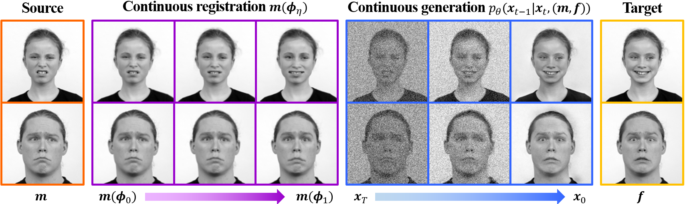

# DiffuseMorph

This repository is the official implementation of "DiffuseMorph: Unsupervised Deformable Image Registration Using Diffusion Model" which is presented at ECCV 2022.

[[ECCV paper](https://link.springer.com/chapter/10.1007/978-3-031-19821-2_20)]

## Requirements
  * OS : Ubuntu
  * Python >= 3.6
  * PyTorch >= 1.4.0

## Data
In our experiments, we used the following datasets:
* 2D facial expression images: [RaFD dataset](https://rafd.socsci.ru.nl/RaFD2/RaFD?p=main)
* 3D cardiac MR images: [ACDC dataset](https://acdc.creatis.insa-lyon.fr/description/databases.html)
* 3D brain MR images: [OASIS-3 dataset](https://www.oasis-brains.org/)

## Training

To train our model for 2D image registration, run this command:

```train
python3 main_2D.py -p train -c config/diffuseMorph_train_2D.json
```
To train our model for 3D image registration, run this command:

```train
python3 main_3D.py -p train -c config/diffuseMorph_train_3D.json
```

## Test

To test the trained our model for 2D image registration, run:

```eval
python3 main_2D.py -p test -c config/diffuseMorph_test_2D.json
```

To test the trained our model for 3D image registration, run:

```eval
python3 main_3D.py -p test -c config/diffuseMorph_test_3D.json
```

## Citation

```    
@inproceedings{kim2022diffusemorph,
  title={DiffuseMorph: Unsupervised Deformable Image Registration Using Diffusion Model},
  author={Kim, Boah and Han, Inhwa and Ye, Jong Chul},
  booktitle={European Conference on Computer Vision},
  pages={347--364},
  year={2022},
  organization={Springer}
}
```
